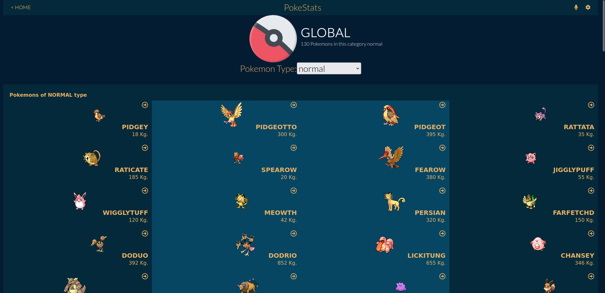
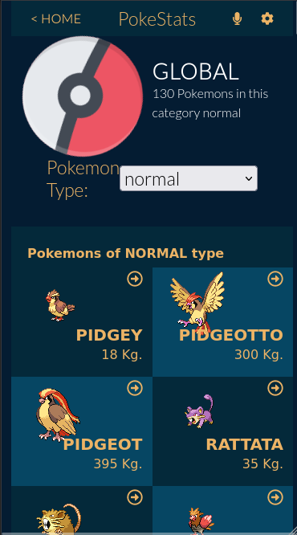

  
  
  
  
  

# PokeStats

> An awesome React/Redux application that displays the stats of a Pokemon. 
> You can filter through the list of Pokemon and see the stats of the Pokemon you choose.
> 

| Desktop version | Mobile version|
|-----------------|---------------|
|  |  | 

## Built With

- Html
- Css
- JavaScript
- React
- Redux
- API
- React Bootstrap
- Jest

## Live Demo

[Live Demo Link](https://theluisabarca.github.io/pokestats-react_redux/)

## Live Explanation
[Live Explanation](https://www.loom.com/share/7c4160ba86854344bca7eae729f481d7)

## Getting Started
To get a local copy up and running follow these simple example steps.

- Click on the top right green "code" button.
- On the dropdown menu, choose "download with zip" button.
- After download, extract the zip file and you have the project on your machine.
- After downloading run `npm i` to install all Node packages.
- Run `npm start` to run the project.

## Author

👤 **Luis Abarca**

- GitHub: [@TheLuisAbarca](https://github.com/TheLuisAbarca)

## 🤝 Contributing

Contributions, issues, and feature requests are welcome!

Feel free to check the [issues page](../../issues/).

## Show your support

Give a ⭐️ if you like this project!

## 📝 License

This project is [MIT](./MIT.md) licensed.